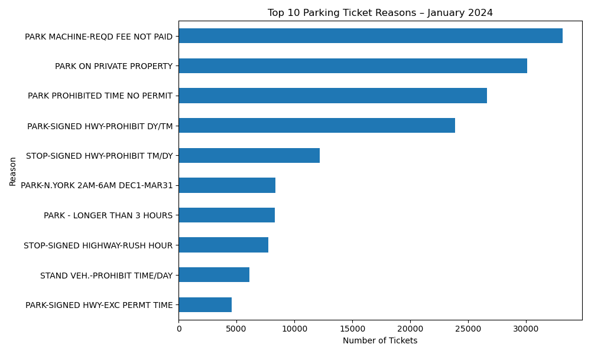
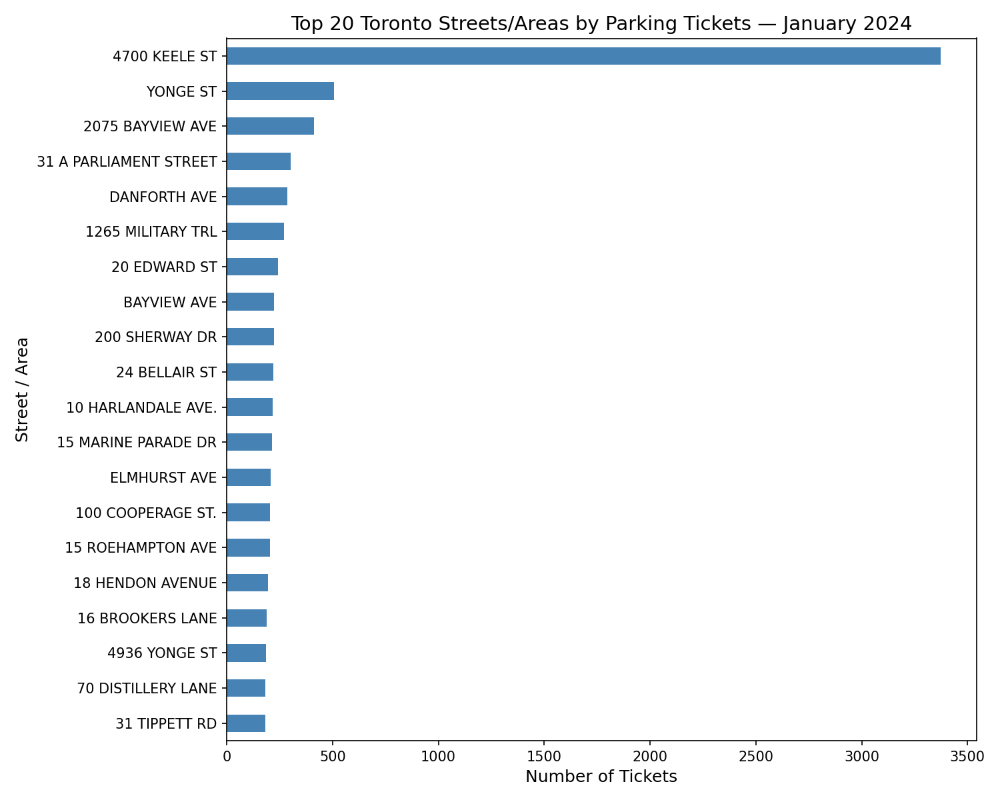

# Data Visualization

## Assignment 3: Final Project

### Requirements:
- We will finish this class by giving you the chance to use what you have learned in a practical context, by creating data visualizations from raw data. 
- Choose a dataset of interest from the [City of Toronto’s Open Data Portal](https://www.toronto.ca/city-government/data-research-maps/open-data/) or [Ontario’s Open Data Catalogue](https://data.ontario.ca/). 
- Using Python and one other data visualization software (Excel or free alternative, Tableau Public, any other tool you prefer), create two distinct visualizations from your dataset of choice.  

Visualization A: 
 
Visualization B:
 

- For each visualization, describe and justify: 
    > What software did you use to create your data visualization?
    - I used Python, specifically the pandas and matplotlib libraries. Pandas was used for data wrangling (cleaning, counting, and summarizing infraction descriptions), while matplotlib was used to generate the horizontal bar chart. This setup is fully open-source and script-based, making it transparent and reproducible.

    > Who is your intended audience? 
    - Toronto drivers/residents who want to avoid common ticket causes and ticket-heavy locations.
    - City planners/policymakers interested in enforcement patterns by reason and by street/intersection.
    - Local businesses/community groups near high-ticket corridors.
    
    > What information or message are you trying to convey with your visualization? 
    - Visualization A (Reasons): Which infractions are most common in January 2024 (e.g., “No Stopping,” “Fail to Display Receipt”).
    - Visualization B (Locations): Where tickets most frequently occur (Top 20 location2 values), highlighting hotspots at the street/intersection level.
    Together, they answer why tickets happen and where they are most likely.
    
    > What aspects of design did you consider when making your visualization? How did you apply them? With what elements of your plots? 
    - Chart choice: Horizontal bar charts for both visuals (long labels read better horizontally; easier ranking comparison).
    - Sorting by frequency: Bars sorted ascending so the eye naturally lands on the largest categories at the top.
    - Minimal color palette: Single neutral hue to keep attention on magnitude, not decoration.
    - Clear titling & labels: Plain language titles (“Top 10 Reasons…”, “Top 20 Streets…”) and explicit x/y labels (“Number of Tickets,” “Reason,” “Street/Area”).
    - Text normalization (data prep): Uppercasing and trimming strings reduces duplicates (e.g., “Queen St W” vs “QUEEN ST W ”).
    
    > How did you ensure that your data visualizations are reproducible? If the tool you used to make your data visualization is not reproducible, how will this impact your data visualization? 
    - Fully code-driven pipeline: pd.read_csv(...) > clean/aggregate > plot > savefig(...).
    - No manual steps: Anyone with the dataset and the script can reproduce identical outputs.
    - Version control ready: The code can live in a repo with pinned library versions to ensure consistent results.
    - If it weren’t reproducible (e.g., hand-edited visuals), others couldn’t verify or update results, undermining trust and maintainability.
    
    > How did you ensure that your data visualization is accessible?  
    - Legible orientation & labels: Horizontal bars prevent label overlap; descriptive titles and axis labels avoid jargon
    - Color considerations: Single, high-contrast color avoids reliance on color hue for meaning (friendlier to color-vision deficiencies).
    - Static export: PNG outputs are easy to share and view on common devices; alt-text can be added where posted.
    
    > Who are the individuals and communities who might be impacted by your visualization?
    - Residents/drivers: May change parking behavior to avoid common reasons/locations.
    - Businesses & neighborhoods: May advocate for signage or policy changes if their area appears in the Top 20.
    - City agencies: Could use findings to review fairness, signage clarity, and enforcement allocation.
    - Note: The charts reflect enforcement activity, which can differ from actual non-compliance; context matters.
    
    > How did you choose which features of your chosen dataset to include or exclude from your visualization? 
    - Included:
        - infraction_description (reason-focused chart)
        - location2 (street/intersection-focused chart)
    The selection matches the questions: why tickets occur (descriptions) and where they concentrate (location2).
    
    > What ‘underwater labour’ contributed to your final data visualization product?
    - Data inspection: Confirming column formats.
    - Cleaning & normalization: Trimming whitespace, uppercasing, dropping blanks/NaNs, checking for duplicates/aliasing in street names.
    - Design iteration: Testing chart orientation, figure size, and label readability for long category names.
    - Sanity checks: Verifying counts, ensuring the Top 10/Top 20 choices are stable, and confirming exports (PNG/CSV).

- This assignment is intentionally open-ended - you are free to create static or dynamic data visualizations, maps, or whatever form of data visualization you think best communicates your information to your audience of choice! 
- Total word count should not exceed **(as a maximum) 1000 words** 
 
### Why am I doing this assignment?:  
- This ongoing assignment ensures active participation in the course, and assesses the learning outcomes: 
* Create and customize data visualizations from start to finish in Python
* Apply general design principles to create accessible and equitable data visualizations
* Use data visualization to tell a story  
- This would be a great project to include in your GitHub Portfolio – put in the effort to make it something worthy of showing prospective employers!

### Rubric:

| Component         | Scoring  | Requirement                                                                 |
|-------------------|----------|-----------------------------------------------------------------------------|
| Data Visualizations | Complete/Incomplete | - Data visualizations are distinct from each other - Data visualizations are clearly identified - Different sources/rationales (text with two images of data, if visualizations are labeled) - High-quality visuals (high resolution and clear data) - Data visualizations follow best practices of accessibility |
| Written Explanations | Complete/Incomplete | - All questions from assignment description are answered for each visualization - Explanations are supported by course content or scholarly sources, where needed |
| Code              | Complete/Incomplete | - All code is included as an appendix with your final submissions - Code is clearly commented and reproducible |

## Submission Information

🚨 **Please review our [Assignment Submission Guide](https://github.com/UofT-DSI/onboarding/blob/main/onboarding_documents/submissions.md)** 🚨 for detailed instructions on how to format, branch, and submit your work. Following these guidelines is crucial for your submissions to be evaluated correctly.

### Submission Parameters:
* Submission Due Date: `23:59 - 11/02/2025`
* The branch name for your repo should be: `assignment-3`
* What to submit for this assignment:
    * A folder/directory containing:
        * This file (assignment_3.md)
        * Two data visualizations 
        * Two markdown files for each both visualizations with their written descriptions.
        * Link to your dataset of choice.
        * Complete and commented code as an appendix (for your visualization made with Python, and for the other, if relevant) 
* What the pull request link should look like for this assignment: `https://github.com/<your_github_username>/visualization/pull/<pr_id>`
    * Open a private window in your browser. Copy and paste the link to your pull request into the address bar. Make sure you can see your pull request properly. This helps the technical facilitator and learning support staff review your submission easily.

Checklist:
- [ ] Create a branch called `assignment-3`.
- [ ] Ensure that the repository is public.
- [ ] Review [the PR description guidelines](https://github.com/UofT-DSI/onboarding/blob/main/onboarding_documents/submissions.md#guidelines-for-pull-request-descriptions) and adhere to them.
- [ ] Verify that the link is accessible in a private browser window.

If you encounter any difficulties or have questions, please don't hesitate to reach out to our team via our Slack. Our Technical Facilitators and Learning Support staff are here to help you navigate any challenges.
